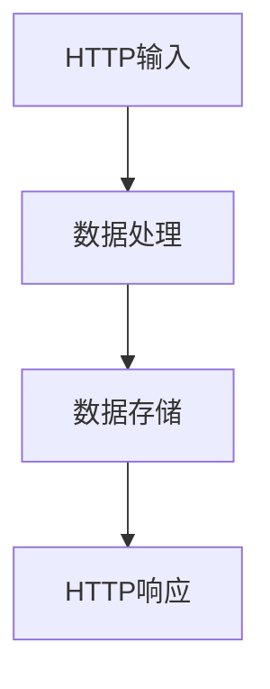
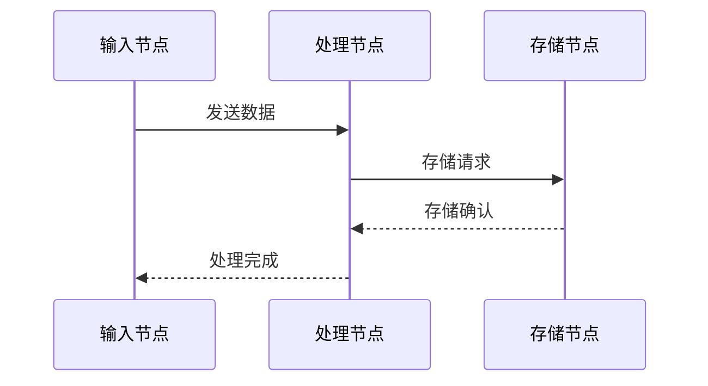
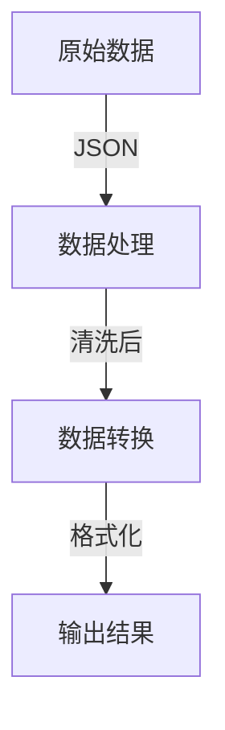
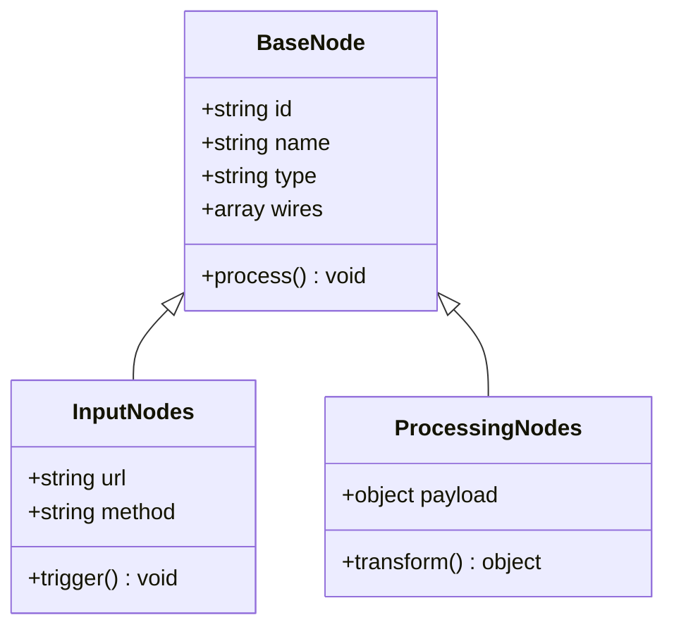
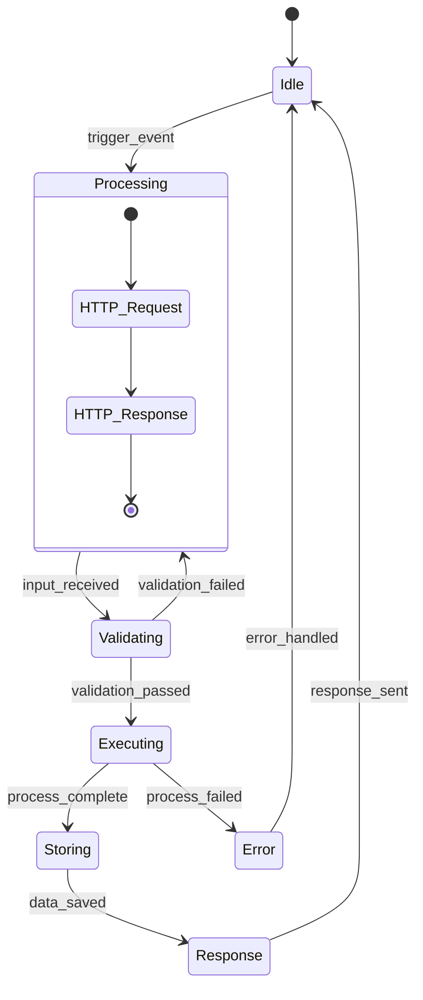
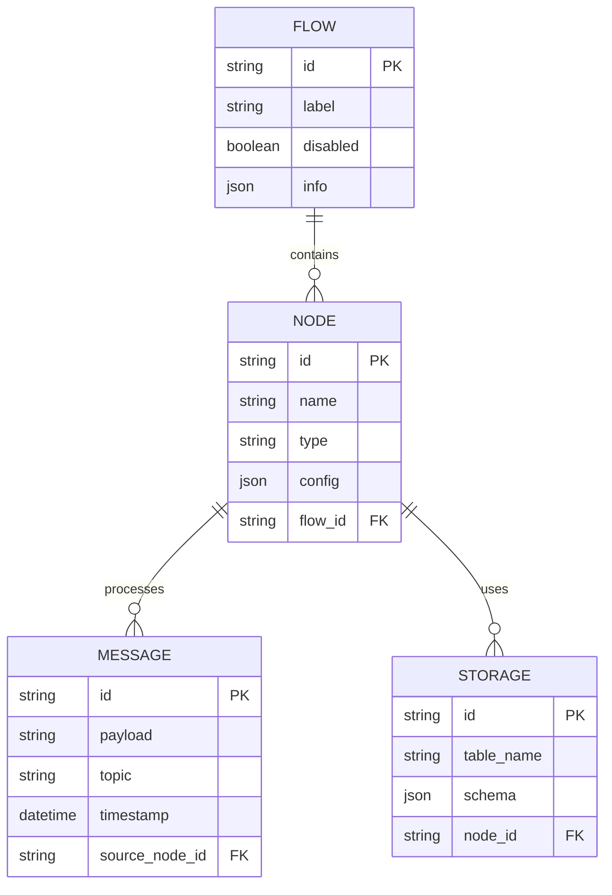
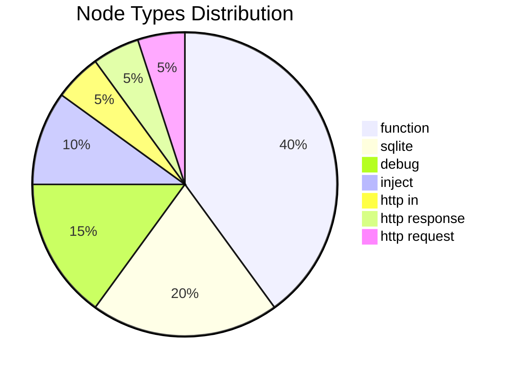
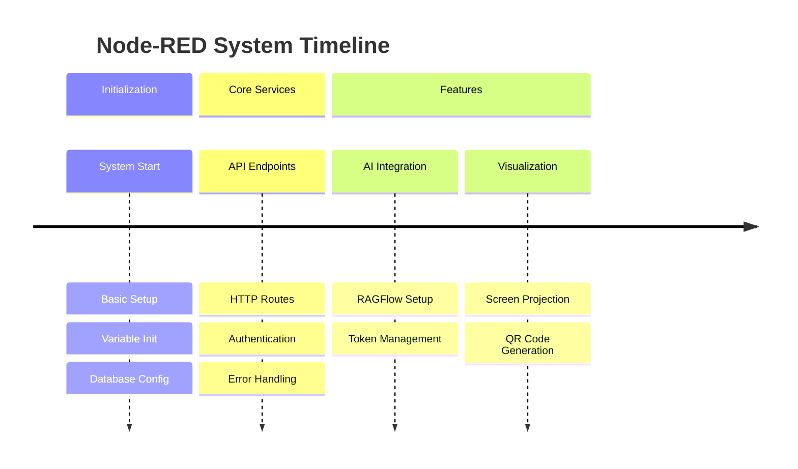
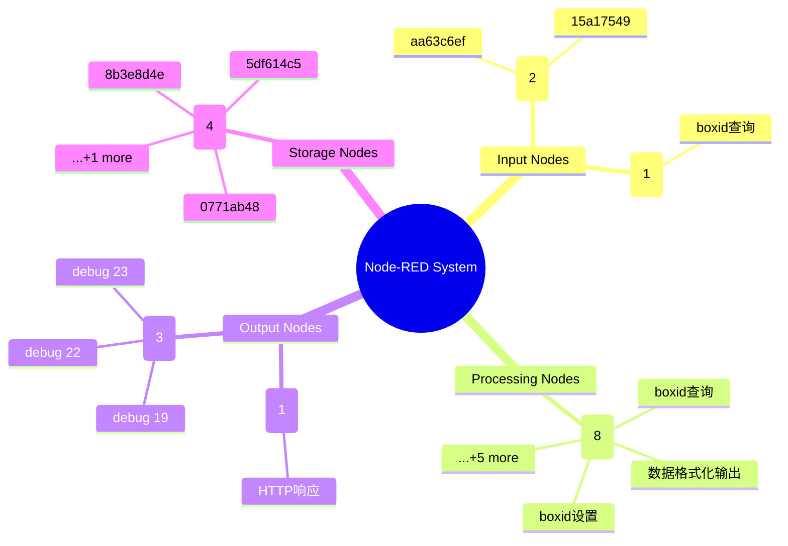
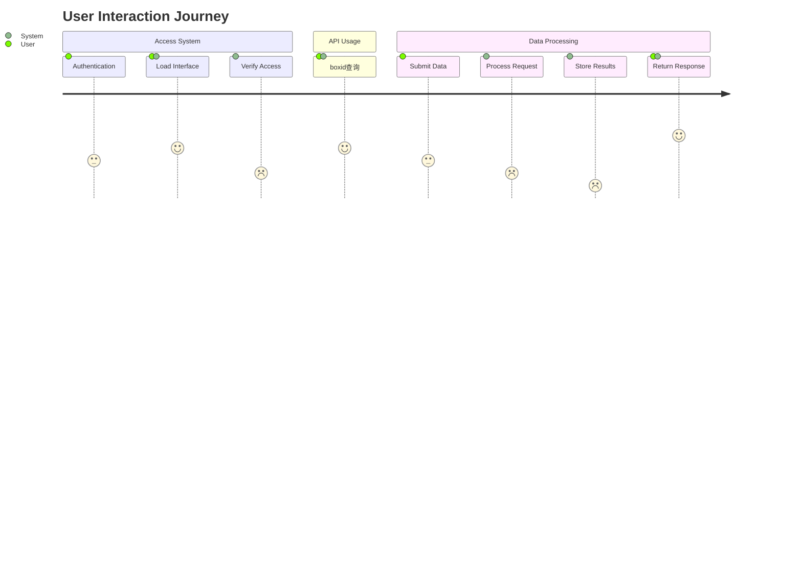

# Node-RED完整可视化模式指南

> 🎨 基于Mermaid的Node-RED系统多维度可视化解决方案

## 📋 概述

本指南介绍了**10种不同的Mermaid图表类型**，用于全面展示Node-RED系统的各个维度。每种模式都有独特的分析视角，覆盖从系统架构到用户体验的完整生态。

---

## 🏗️ 基础三种模式 (已实现)

### 1️⃣ 流程架构图 (flowchart TD)
**🎯 用途**: 展示系统整体架构和节点连接关系  
**💡 适用场景**: 系统概览、架构设计、技术文档



**✨ 特色**:
- 智能节点形状选择 (圆形、方形、菱形等)
- 自动子图分组
- 连接关系清晰展示

---

### 2️⃣ 通信序列图 (sequenceDiagram)
**🎯 用途**: 展示节点间消息传递的时序关系  
**💡 适用场景**: 时序分析、调试、性能优化



**✨ 特色**:
- 自动消息类型推断
- 时序逻辑分析
- 异步消息区分

---

### 3️⃣ 数据流管道图 (flowchart TD with annotations)
**🎯 用途**: 展示数据在系统中的流动和转换过程  
**💡 适用场景**: 数据分析、ETL设计、流程优化



**✨ 特色**:
- 数据类型智能标注
- 转换过程可视化
- 多路径数据流支持

---

## 🚀 扩展七种模式 (新增)

### 4️⃣ 节点类型关系图 (classDiagram)
**🎯 用途**: 展示节点类型的分类、继承关系和属性结构  
**💡 适用场景**: 系统架构分析、节点设计、API文档生成



**✨ 特色**:
- 自动提取节点属性
- 面向对象建模
- 继承关系清晰

**🔧 技术实现**:
- 分析节点配置提取通用属性
- 按功能分类构建类层次
- 自动生成UML类图语法

---

### 5️⃣ 状态变化图 (stateDiagram-v2)
**🎯 用途**: 展示系统状态转换和生命周期  
**💡 适用场景**: 状态机设计、错误处理分析、系统调试



**✨ 特色**:
- 智能状态推断
- 嵌套状态支持
- 错误处理路径

**🔧 技术实现**:
- 基于节点类型推断状态转换
- 分析连接关系构建状态图
- 特殊节点类型的状态细化

---

### 6️⃣ 数据实体关系图 (erDiagram)
**🎯 用途**: 展示数据存储结构和关系模型  
**💡 适用场景**: 数据库设计、数据建模、存储优化



**✨ 特色**:
- 标准ER模型
- 自动识别存储节点
- 关系类型智能推断

**🔧 技术实现**:
- 识别数据存储相关节点
- 分析Node-RED数据模型
- 构建标准数据库关系图

---

### 7️⃣ 统计饼图 (pie)
**🎯 用途**: 展示节点类型分布和统计分析  
**💡 适用场景**: 系统监控、资源分析、性能评估



**✨ 特色**:
- 实时统计分析
- 直观比例展示
- 自动排序优化

**🔧 技术实现**:
- 统计各节点类型数量
- 按使用频率排序
- 限制显示类型数量避免过载

---

### 8️⃣ 部署时间线 (timeline)
**🎯 用途**: 展示系统部署历史和配置时间线  
**💡 适用场景**: 部署管理、版本控制、历史追踪



**✨ 特色**:
- 阶段化时间展示
- 并行任务支持
- 逻辑时序推断

**🔧 技术实现**:
- 基于系统功能分析推断部署顺序
- 将节点按功能分组到时间段
- 构建逻辑时间线（非实际时间）

---

### 9️⃣ 配置层次图 (mindmap)
**🎯 用途**: 展示系统配置的层次结构和组织关系  
**💡 适用场景**: 系统概览、配置管理、知识图谱



**✨ 特色**:
- 层次化知识图谱
- 智能节点分类
- 数量统计显示

**🔧 技术实现**:
- 多级分类 (类别 → 类型 → 实例)
- 统计信息集成
- 限制显示数量避免过载

---

### 🔟 用户交互旅程 (journey)
**🎯 用途**: 展示用户与系统的交互流程和体验  
**💡 适用场景**: UX设计、用户分析、交互优化



**✨ 特色**:
- 用户体验视角
- 交互满意度评分
- 系统响应分析

**🔧 技术实现**:
- 识别HTTP入口点作为用户交互
- 分析用户交互流程
- 基于节点复杂度推断满意度

---

## 🎯 应用场景矩阵

| 可视化模式 | 架构设计 | 系统调试 | 性能分析 | 文档生成 | 用户体验 | 数据建模 |
|------------|----------|----------|----------|----------|----------|----------|
| 流程架构图 | ⭐⭐⭐ | ⭐⭐ | ⭐ | ⭐⭐⭐ | ⭐ | ⭐ |
| 通信序列图 | ⭐⭐ | ⭐⭐⭐ | ⭐⭐⭐ | ⭐⭐ | ⭐ | ⭐ |
| 数据流图 | ⭐⭐ | ⭐⭐ | ⭐⭐ | ⭐⭐ | ⭐ | ⭐⭐⭐ |
| 类型关系图 | ⭐⭐⭐ | ⭐ | ⭐ | ⭐⭐⭐ | ⭐ | ⭐⭐ |
| 状态变化图 | ⭐⭐ | ⭐⭐⭐ | ⭐⭐ | ⭐⭐ | ⭐ | ⭐ |
| 实体关系图 | ⭐⭐ | ⭐ | ⭐ | ⭐⭐ | ⭐ | ⭐⭐⭐ |
| 统计饼图 | ⭐ | ⭐ | ⭐⭐⭐ | ⭐⭐ | ⭐ | ⭐ |
| 部署时间线 | ⭐⭐ | ⭐ | ⭐ | ⭐⭐⭐ | ⭐ | ⭐ |
| 配置层次图 | ⭐⭐⭐ | ⭐ | ⭐ | ⭐⭐⭐ | ⭐ | ⭐ |
| 用户旅程图 | ⭐ | ⭐ | ⭐ | ⭐⭐ | ⭐⭐⭐ | ⭐ |

---

## 🚀 使用指南

### 快速开始

```bash
# 基础三种模式
node src/demo-specific-flow.js

# 扩展七种模式
node src/demo-extended-modes.js

# 自定义流程测试
node src/demo-any-flow.js --flow-name "你的流程名称"
```

### API调用示例

```javascript
const ExtendedVisualizationModes = require('./extended-visualization-modes');

const visualizer = new ExtendedVisualizationModes({
    url: 'http://your-nodered:1880',
    credentials: {
        username: 'admin',
        password: 'password'
    }
});

// 生成所有模式
await visualizer.authenticate();
const flows = await visualizer.getFlows();

// 基础模式
const flowChart = visualizer.generateMermaid(flows, 'flow');
const sequenceChart = visualizer.generateMermaid(flows, 'communication');
const dataflowChart = visualizer.generateMermaid(flows, 'dataflow');

// 扩展模式
const classChart = visualizer.generateNodeClassDiagram(flows);
const stateChart = visualizer.generateStateDiagram(flows);
const erChart = visualizer.generateEntityRelationshipDiagram(flows);
const pieChart = visualizer.generateStatisticsPieChart(flows);
const timelineChart = visualizer.generateDeploymentTimeline(flows);
const mindmapChart = visualizer.generateConfigurationMindmap(flows);
const journeyChart = visualizer.generateUserJourneyMap(flows);
```

---

## 🎨 技术架构

### 核心组件

1. **基础转换器** (`NodeRedMermaidConverter`)
   - Node-RED API交互
   - 数据预处理
   - 基础三种模式实现

2. **扩展转换器** (`ExtendedVisualizationModes`)
   - 继承基础转换器
   - 扩展七种模式实现
   - 智能分析算法

3. **演示脚本集**
   - 功能演示
   - 性能测试
   - 代码示例

### 设计原则

- **自动化**: 无需人工配置，完全基于数据驱动
- **智能化**: 语义分析，智能推断
- **标准化**: 遵循Mermaid语法规范
- **可扩展**: 模块化设计，便于添加新模式

---

## 🎯 最佳实践

### 1. 选择合适的可视化模式

**系统设计阶段**:
- 使用**流程架构图**了解整体结构
- 使用**类型关系图**设计节点体系
- 使用**配置层次图**规划系统组织

**开发调试阶段**:
- 使用**通信序列图**分析消息流
- 使用**状态变化图**调试状态逻辑
- 使用**数据流图**追踪数据转换

**运维监控阶段**:
- 使用**统计饼图**监控系统组成
- 使用**部署时间线**管理版本历史

**用户体验优化**:
- 使用**用户旅程图**分析交互流程
- 使用**实体关系图**优化数据模型

### 2. 组合使用策略

**完整分析流程**:
1. **概览**: 配置层次图 → 统计饼图
2. **架构**: 流程架构图 → 类型关系图
3. **逻辑**: 通信序列图 → 状态变化图
4. **数据**: 数据流图 → 实体关系图
5. **体验**: 用户旅程图
6. **历史**: 部署时间线

### 3. 性能优化建议

- 大型系统使用流程过滤
- 复杂节点限制显示数量
- 定期更新缓存数据
- 异步并行生成多种模式

---

## 🔮 未来扩展方向

### 新图表类型潜力

1. **甘特图 (gantt)**: 任务调度和时间管理
2. **Git图 (gitgraph)**: 版本分支管理
3. **桑基图 (sankey)**: 数据流量可视化
4. **象限图 (quadrantChart)**: 节点优先级分析

### 增强功能

1. **交互式图表**: 支持点击钻取
2. **实时更新**: 监听Node-RED变化
3. **主题定制**: 支持多种可视化主题
4. **导出功能**: SVG、PNG、PDF等格式

### 集成生态

1. **MCP服务器集成**: 作为标准MCP工具
2. **Node-RED插件**: 直接在编辑器中使用
3. **CI/CD集成**: 自动文档生成
4. **监控系统**: 实时可视化仪表板

---

## 📝 总结

本指南介绍的**10种可视化模式**为Node-RED系统提供了全方位、多维度的分析视角。每种模式都有其独特的应用场景和技术特色，组合使用可以实现对复杂系统的完整理解和优化。

**核心价值**:
- 🎯 **全面性**: 覆盖架构、逻辑、数据、体验等各个维度
- 🚀 **自动化**: 完全基于数据驱动，无需人工绘图
- 🎨 **标准化**: 使用Mermaid标准语法，兼容性强
- 💡 **智能化**: 语义分析和智能推断，生成高质量图表

通过这套完整的可视化解决方案，Node-RED开发者和运维人员可以更好地理解、设计、调试和优化他们的系统。 